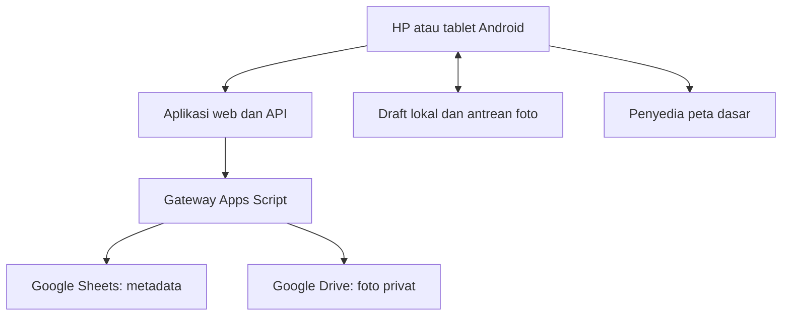

# Rencana Aplikasi Inspeksi Geoteknik Harian

**Tanggal:** 8 Oktober 2026  
**Status:** Draf revisi 1.1 untuk review Alfan; lima kebutuhan operasional dikonfirmasi pada 8 Oktober 2026. Implementasi belum dimulai.  
**Pelaksana pengembangan yang direncanakan:** Claude Code dengan Sonnet 5.5, melalui repository GitHub.  
**Pedoman:** AGENTS.md terlampir, “Ponytail, lazy senior dev mode”.

## 1. Tujuan dan batas rencana

Membuat aplikasi web yang nyaman digunakan melalui HP dan tablet Android untuk mencatat inspeksi visual geoteknik harian, mengambil foto, menentukan lokasi pada peta, menyimpan koordinat, serta meninjau kembali hasil inspeksi. Foto disimpan secara privat di Google Drive. Kode, konfigurasi contoh, dokumentasi, dan riwayat perubahan dikelola melalui GitHub.

“Visual” dalam rencana ini berarti formulir berbasis kartu, kamera/galeri, peta, dan riwayat foto. Tidak ada pengenalan retakan atau penilaian kestabilan otomatis oleh AI dalam versi awal. Claude digunakan untuk pengembangan aplikasi; aplikasi tidak memerlukan panggilan Claude API saat petugas mengisi inspeksi.

Rencana ini menyajikan rancangan produk dan urutan implementasi yang dapat direview sekaligus. Belum ada repository, akun layanan, gateway, atau aplikasi yang dibuat. Struktur file adalah usulan; jika menggunakan repository yang sudah ada, Claude harus memeriksa dan memakai kembali implementasi yang sesuai sebelum membuat penggantinya.

### Kebutuhan yang sudah ditetapkan pengguna

| Kebutuhan | Implikasi rancangan |
|---|---|
| Inspeksi geoteknik harian secara visual | Foto, checklist ringkas, catatan kondisi, dan tampilan peta |
| Foto disimpan di Google Drive | Drive menjadi penyimpanan foto resmi |
| Peta untuk memilih lokasi | GPS, pin manual, dan lokasi tersimpan |
| Koordinat disimpan | Koordinat terstruktur, metode penentuan, dan waktu pengambilan |
| Web berbasis GitHub | Source control, review perubahan, pengujian, dan deployment terpisah dari penyimpanan kode |
| Mayoritas akses Android | Desain sentuh, kamera, keterbacaan luar ruangan, uji perangkat nyata |
| Menggunakan AGENTS.md | Implementasi minimum, reuse, validasi, dan pemeriksaan yang dapat dijalankan |

### Keputusan pengguna yang sudah dikonfirmasi — 8 Oktober 2026

| Aspek | Keputusan | Implikasi |
|---|---|---|
| Petugas | Maksimal dua orang yang melakukan inspeksi | Rancangan dan pengujian mengutamakan dua alur pengisian bersamaan; jumlah reviewer belum ditentukan |
| Koneksi lapangan | Sekitar 80% lokasi tercover GSM | Form dan foto harus tetap dapat dicatat di lokasi tanpa sinyal |
| Foto | Cukup dikompresi | Tidak perlu alur arsip foto original dalam lingkup awal |
| Penyimpanan | Google Drive perusahaan | Gunakan lokasi penyimpanan dan izin yang dikelola perusahaan |
| Akses | Dikelola per perangkat | Aktivasi perangkat oleh admin; tanpa akun pribadi per inspector |

Persentase cakupan lokasi bukan ukuran keandalan atau kecepatan jaringan. Upload tetap harus pulih dari koneksi lambat/putus di area yang tercover. Jumlah petugas tidak otomatis menetapkan jumlah perangkat terdaftar; daftar perangkat aktif dapat dikelola admin.

### Asumsi kerja yang masih perlu direview

- Aplikasi digunakan oleh satu tim/site terlebih dahulu.
- Bahasa antarmuka Indonesia dan waktu tampilan WIB; waktu sistem tersimpan dalam UTC.
- Metadata inspeksi boleh disimpan di Google Sheets; pengguna baru menetapkan Drive untuk foto.
- Hosting yang diusulkan Vercel. GitHub menyimpan kode; Vercel menjalankan web dan endpoint server.
- Akses per perangkat telah ditetapkan; petugas memilih namanya untuk catatan operasional, tanpa registrasi Google individual.
- Draft offline merupakan kebutuhan wajib. Sebelum berangkat, perangkat memuat app shell, template, dan lokasi tersimpan saat online; peta dasar offline penuh tetap opsi lanjutan.
- Satu inspeksi mewakili satu lokasi pada satu waktu kunjungan, dengan beberapa temuan/foto di lokasi yang sama. Temuan berjauhan dibuat sebagai inspeksi terpisah agar koordinat tidak menyesatkan.
- Target uji dasar: dua petugas mengirim dari dua perangkat secara bersamaan, sampai lima foto per inspeksi sebagai usulan awal. Jumlah inspeksi per hari belum ditetapkan; angka simulasi kapasitas bukan kebutuhan yang sudah disetujui.

## 2. Pilihan arsitektur

| Pilihan | Susunan | Kelebihan | Keterbatasan | Penggunaan |
|---|---|---|---|---|
| A — usulan awal | Next.js/TypeScript + endpoint server + Apps Script + Sheets + Drive | Data mudah diperiksa tim; akun Google pemilik menangani penyimpanan; layanan relatif sedikit | Kuota, penulisan serentak, dan konsistensi Sheets–Drive perlu ditangani | Pilot satu site dengan beban terukur |
| B | Next.js + database PostgreSQL terkelola + Drive API | Transaksi, pencarian, peran pengguna, dan pertumbuhan data lebih baik | Menambah layanan, biaya, migrasi, dan pengaturan otorisasi Drive | Banyak pengguna/site, kontrol identitas kuat, atau pilot A gagal |
| C | Apps Script HTML Service + Sheets + Drive | Hosting dan backend berada dalam ekosistem Google | Fleksibilitas PWA, offline, dan antarmuka mobile perlu kompromi | Form sederhana yang terutama selalu online |

**Rekomendasi untuk maksimal dua inspector:** mulai dengan A melalui uji teknis kecil terlebih dahulu. Jangan membangun seluruh antarmuka sebelum memastikan upload, pembacaan foto privat, retry, dan kebijakan akun Google bekerja. Jika batas A tidak memenuhi kebutuhan yang disetujui, pilih B pada tahap ini. Keinginan menyimpan foto di Drive tidak mewajibkan semua metadata berada di Sheets.

Next.js dipilih agar halaman dan endpoint server berada dalam satu proyek. Leaflet digunakan untuk peta 2D. Gunakan fitur browser untuk kamera, lokasi, dan penyimpanan lokal; hindari pustaka besar untuk kebutuhan yang sudah tersedia secara native. Kunci versi dependency yang telah diuji saat proyek dimulai.

### Aliran data yang diusulkan

Browser hanya mengirim data aplikasi ke endpoint server milik aplikasi. Endpoint memeriksa sesi dan payload lalu meneruskan permintaan ke gateway. Kredensial gateway tidak dibundel ke JavaScript browser. Foto ditampilkan melalui endpoint yang memeriksa akses; tautan Drive publik tidak diperlukan.

Apps Script Content Service menggunakan redirect; klien server perlu menanganinya. Jangan menjadikan panggilan lintas domain dari browser ke Apps Script sebagai fondasi integrasi. Pengaturan web app harus diuji dengan kebijakan Google Workspace aktual; akun perusahaan dapat membatasi akses endpoint. [S3, S4]

## 3. Lingkup versi pertama

| Fitur | Isi versi pertama | Kriteria selesai |
|---|---|---|
| Akses tim | Sesi perangkat yang diaktivasi dan dapat dicabut admin | Pengunjung tanpa akses tidak bisa membaca foto atau menulis data |
| Inspeksi baru | Area, lokasi, waktu, petugas, checklist, catatan | Bisa diselesaikan tanpa berpindah aplikasi |
| Foto | Kamera/galeri, preview, caption, hapus sebelum kirim | Foto tersimpan di Drive dan dapat dibuka kembali |
| Peta | GPS, pin manual, lokasi tersimpan | Koordinat yang disetujui petugas tersimpan bersama inspeksi |
| Draft | Penyimpanan lokal formulir dan blob foto | Reload aplikasi tidak menghilangkan draft pada kondisi penyimpanan normal |
| Pengiriman | Progres per foto, retry, status jelas | Putus jaringan tidak menghasilkan status sukses palsu atau duplikasi |
| Riwayat | Kartu inspeksi dan filter tanggal/area/status | Petugas/reviewer dapat mencari dan membuka catatan |
| Review sederhana | Catatan reviewer, tindak lanjut, foto penutupan | Temuan belum selesai dapat dibedakan dari yang ditutup |
| Ekspor | CSV dan GeoJSON | Data dapat dipakai di Excel/QGIS dengan koordinat benar |
| PWA dasar | Ikon layar utama dan app shell tersimpan | Bisa dibuka seperti aplikasi setelah pemasangan pada perangkat yang mendukung |

Ditunda: AI analisis foto, dashboard RTS/VWP/radar, notifikasi WhatsApp otomatis, peta 3D, routing kendaraan, editor GeoTIFF besar, approval bertingkat, multi-site, dan laporan PDF otomatis. Tambahkan hanya ketika ada kebutuhan pengguna yang nyata. Ekspor XLSX berformat dan PDF dapat menjadi tahap berikutnya.

## 4. Alur penggunaan di lapangan

1. Sebelum berangkat, buka aplikasi saat online untuk memuat formulir, lokasi tersimpan, dan memeriksa kesiapan penyimpanan offline. Beranda menampilkan tombol besar **Inspeksi Baru**, jumlah draft belum terkirim, serta inspeksi terbaru.
2. Pilih nama petugas dari daftar dua inspector dan pilih area. Akses mengikuti sesi perangkat; nama yang dipilih merupakan identitas pelaporan, bukan autentikasi individual.
3. Pilih lokasi tersimpan atau lokasi baru. Ambil GPS bila tersedia, lalu konfirmasi pin objek pada peta.
4. Isi checklist sesuai jenis area. Semua jawaban awal kosong; aplikasi tidak menganggap item sudah diperiksa.
5. Tambahkan temuan, keterangan, dan foto. Foto bisa dikaitkan ke temuan tertentu.
6. Review ringkasan: lokasi, koordinat, waktu, kondisi, foto, dan item belum lengkap.
7. Tekan **Kirim**. Bila offline, tampilkan **Tersimpan di perangkat — belum terkirim**.
8. Saat online, kirim metadata dan foto melalui antrean. Tampilkan progres seperti **3 dari 5 foto tersimpan**.
9. Baru tampilkan **Terkirim** setelah server mengonfirmasi metadata dan semua foto yang diwajibkan tersimpan.
10. Reviewer membuka catatan, menetapkan tindak lanjut bila diperlukan, dan menutupnya setelah ada bukti penyelesaian.

Draft adalah penyimpanan sementara perangkat. Setelah foto dan data diakui server, salinan lokal boleh dibersihkan sesuai kebijakan. Aplikasi harus memperingatkan jika masih ada antrean saat petugas hendak keluar/ganti perangkat. Tidak boleh menghapus antrean diam-diam saat logout atau pembaruan aplikasi.

## 5. Rancangan layar mobile

| Layar | Isi utama | Keputusan desain |
|---|---|---|
| Beranda | Inspeksi Baru, Draft, Belum Terkirim, Riwayat | Tombol tindakan utama terlihat tanpa scroll panjang |
| Form | Informasi kunjungan, checklist, temuan | Kelompok pendek; hanya tampilkan kolom yang relevan |
| Lokasi | Peta, posisi petugas, pin objek, koordinat | Dua marker berbeda dengan label yang jelas |
| Foto | Ambil Foto, Pilih Galeri, thumbnail, caption | Preview besar; tidak memuat semua foto resolusi penuh sekaligus |
| Ringkasan | Hasil pengisian dan status upload | Kesalahan muncul di dekat kolom yang perlu diperbaiki |
| Riwayat | Kartu foto, area, tanggal, status | Filter sederhana dan pemuatan bertahap |
| Detail | Foto, checklist, peta, catatan review | Riwayat revisi dapat diperiksa |

Usulan visual: latar terang, teks gelap, aksen hijau/biru, font isi sekitar 16 px, dan sasaran sentuh minimal sekitar 48 px. Status selalu memakai teks/ikon, bukan warna saja. Pada HP satu kolom; tablet dapat memakai dua kolom. Kamera tidak otomatis dipaksa terbuka; pengguna tetap bisa memilih galeri.

Target pengujian lebar: 360–430 px untuk HP dan 768–1024 px untuk tablet, portrait dan landscape. Angka ini merupakan target desain awal, bukan daftar perangkat yang sudah diuji.

## 6. Isi inspeksi geoteknik

### Informasi umum

Petugas, tanggal/jam observasi, area, lokasi, jenis inspeksi, cuaca yang diamati, catatan aktivitas setempat, dan referensi inspeksi sebelumnya bila ada. Curah hujan dalam mm hanya dimasukkan bila sumber serta periode pengukurannya tersedia; cuaca visual tidak dikonversi menjadi angka hujan.

### Template checklist awal untuk direview engineer

| Jenis area | Usulan kelompok observasi |
|---|---|
| Pit/lereng | Retakan, rockfall/raveling, perubahan crest/toe, material lepas, seepage, drainase, akses |
| Waste dump | Retakan/settlement, deformasi toe, erosi, seepage, drainase, kondisi penempatan material |
| Heap leach pad | Retakan/settlement, perubahan lereng, drainase/ponding, seepage, kondisi proteksi/liner yang terlihat dari area inspeksi |
| Dam/pond | Retakan/settlement, erosi, seepage, kondisi drain/outlet, kondisi muka air yang terlihat |

Pilihan jawaban: **Tidak ada temuan**, **Ada temuan**, **Tidak diperiksa**, dan **Tidak berlaku**. Jawaban terakhir berbeda makna dan harus disimpan terpisah. Untuk “Ada temuan”, minta jenis temuan, deskripsi, dan foto. Jika foto tidak dapat diambil, simpan alasan serta status perlu review; jangan memaksa petugas mendekati area berbahaya hanya untuk menyelesaikan form.

Ukuran retakan, panjang, perpindahan, atau debit bersifat opsional dan harus menyebut satuan serta metode pengukuran. Nilai tidak diketahui tetap kosong/null, bukan nol.

Usulan label tindak lanjut: **Rutin**, **Perlu review**, **Segera dilaporkan**. Definisi final ditentukan engineer site berdasarkan prosedur/TARP yang berlaku. Aplikasi tidak menghitung kestabilan, menetapkan ambang geoteknik sendiri, atau menyatakan area aman dari foto. Pelaporan mendesak tetap menggunakan saluran komunikasi site; aplikasi tidak dianggap telah memberi tahu pihak lain hanya karena catatan tersimpan.

## 7. Peta, GPS, dan koordinat

### Penentuan lokasi

- **GPS perangkat:** ambil latitude, longitude, accuracy dalam meter, dan timestamp posisi.
- **Pin manual:** petugas menempatkan titik objek dari posisi pengamatan yang aman.
- **Lokasi tersimpan:** pilih lokasi bernama yang koordinatnya dikelola admin.
- **Koordinat manual:** input WGS84 bila GPS/peta tidak tersedia; validasi rentang dan tampilkan pratinjau sebelum konfirmasi.

Posisi petugas dan posisi objek adalah dua data berbeda. Bila pin digeser, simpan `location_method=manual_pin`; jangan menempelkan nilai akurasi GPS petugas sebagai akurasi objek. Pertahankan koordinat GPS pengamatan terpisah bila tersedia. Lokasi master disalin sebagai snapshot pada inspeksi sehingga perubahan master tidak memindahkan catatan historis.

Simpan koordinat utama WGS84/EPSG:4326. Ekspor CSV memberi kolom `longitude` dan `latitude` terpisah; GeoJSON memakai urutan `[longitude, latitude]`. Koordinat tampilan dapat memakai enam angka desimal, tetapi jumlah desimal bukan jaminan ketelitian.

Untuk UTM, grid tambang, atau RL, gunakan CRS/datum dan parameter transformasi yang dikonfirmasi tim survey. Jangan menetapkan grid hanya berdasarkan nama lokasi. Elevasi GPS tidak boleh otomatis dianggap RL survey.

Geolocation memerlukan izin pengguna dan secure context/HTTPS. Penolakan izin, timeout, atau posisi tidak tersedia harus mengarah ke pin/lokasi tersimpan, bukan memblokir seluruh formulir. Tidak ditetapkan batas akurasi wajib sebelum diuji di lapangan. [S7]

### Peta dasar

Leaflet menyediakan antarmuka peta; tile/basemap adalah layanan terpisah. OpenStreetMap dapat menjadi awal untuk konteks umum, tetapi bukan peta operasional tambang yang selalu mutakhir. Atribusi dan ketentuan penyedia harus dipenuhi. Server tile publik OSM tidak mengizinkan prefetch/bulk download untuk peta offline. [S6, S10]

Tahap awal: peta online dan batas area GeoJSON yang sudah diverifikasi. Tahap berikutnya: orthophoto/georeferenced site map milik perusahaan yang dikonversi menjadi format ringan, disertai tanggal peta dan CRS. Jangan menyajikan TIF besar langsung di HP. Saat offline dan basemap tidak tersedia, formulir, koordinat, dan lokasi master yang sudah tersimpan tetap dapat dipakai; jangan mengklaim seluruh peta tersedia offline.

## 8. Struktur data dan foto

### Metadata Google Sheets yang diusulkan

| Tabel/tab | Kunci dan data utama |
|---|---|
| Locations | `location_id`, `area_id`, nama, latitude, longitude, sumber koordinat, aktif/nonaktif |
| Inspections | `inspection_id`, petugas, waktu observasi, waktu diterima server, area/lokasi, snapshot koordinat, metode lokasi, GPS terpisah, cuaca, checklist JSON, versi template, status, versi record |
| Findings | `finding_id`, `inspection_id`, item checklist, jenis, deskripsi, ukuran/satuan/metode opsional, prioritas, tindak lanjut, status |
| Photos | `photo_id`, `inspection_id`, `finding_id` opsional, Drive file ID yang dicadangkan, caption, ukuran, tipe, checksum, status upload, waktu yang tersedia |
| Audit | `event_id`, actor, jenis perubahan, record ID, waktu server, versi sebelum/sesudah, alasan/perubahan |

Daftar area dan checklist awal dapat berada pada satu file konfigurasi berversi di GitHub; jangan membangun editor template lengkap bila perubahan jarang. Daftar lokasi perlu disimpan sebagai data karena akan dipilih dan ditambahkan dalam pekerjaan.

Gunakan UUID stabil yang dibuat saat draft dimulai. ID tidak bergantung pada nomor baris Sheets, nama petugas, atau waktu HP. Waktu foto dari EXIF bersifat opsional dan tidak dianggap identitas/waktu tepercaya. Simpan `observed_at` dan `received_at` secara terpisah agar jam perangkat salah atau submit tertunda dapat terlihat.

### Organisasi Drive

Usulan pola folder: `Geotech_Inspection/production/YYYY/MM/AREA/INSPECTION_ID/`. Staging memakai root terpisah. Nama foto mencantumkan ID foto dan urutan, bukan hanya timestamp. Folder mempermudah pencarian manual; relasi aplikasi memakai file ID, bukan nama/path folder.

Google Drive perusahaan telah ditetapkan. Owner/admin perusahaan menentukan folder, pemilik operasional, dan pengganti. Pilihan Shared Drive atau My Drive akun perusahaan belum diketahui dan harus dibuktikan pada uji awal; jangan mengasumsikan semua perusahaan mempunyai Shared Drive atau mengizinkan deployment Apps Script eksternal. Jika Shared Drive tersedia dan diizinkan, uji akses gateway ke sana; jika tidak, gunakan folder akun perusahaan yang disetujui.

Foto tetap privat. Aplikasi mengotorisasi pembacaan berdasarkan inspeksi yang dapat diakses. Endpoint foto tidak boleh menerima file ID Drive sembarang lalu mengembalikan isinya. Reviewer yang membuka link Drive langsung memerlukan izin Google yang sesuai; pembacaan lewat aplikasi mengikuti sesi aplikasi.

### Ukuran dan kualitas foto — usulan awal

- 1–5 foto per inspeksi sebagai batas pilot yang dapat direview.
- Salinan kerja JPEG, sisi panjang maksimum awal 2048 px, kualitas awal sekitar 0,8, dan ukuran hasil maksimum 2 MB/foto.
- Kompresi diproses satu per satu, memperhatikan orientasi dan memori Android.
- Jika batas tercapai dengan kualitas yang tidak memadai, beri pilihan ambil ulang/batalkan, jangan mengunggah foto kabur secara diam-diam.
- File rusak/format tidak didukung menghasilkan pesan yang jelas; MIME dan signature diverifikasi server.
- Pengguna telah menyetujui foto terkompresi saja. Aplikasi hanya mengarsipkan salinan terkompresi; tidak membangun alur unggah original. Foto yang dipilih dari galeri tidak dihapus oleh aplikasi. Kamera browser tidak dijanjikan otomatis menyimpan foto asli ke galeri.

Vercel Functions mendokumentasikan batas body request/response 4,5 MB. Kirim satu foto per request. Bila diteruskan sebagai base64 ke Apps Script, ukuran naik kira-kira sepertiga; JSON juga menambah ukuran. Batas 2 MB adalah usulan rancangan dengan margin, bukan batas resmi Drive. Uji foto nyata sebelum menetapkannya. [S5]

## 9. Draft, upload, dan pemulihan kegagalan

Form dan blob foto disimpan di IndexedDB. Gunakan penyimpanan native dengan satu modul kecil; bila pengelolaan transaksinya terbukti rawan, wrapper kecil dapat dipilih dengan alasan eksplisit. Service worker hanya menangani app shell/aset statis; foto privat dan respons sesi tidak boleh masuk cache publik.

Urutan pengiriman:

1. `prepareInspection`: validasi data; buat/upsert metadata berstatus `uploading` berdasarkan UUID.
2. Reservasi Drive file ID untuk setiap `photo_id`; simpan pemetaan sebelum mengunggah byte.
3. Upload foto satu per satu dengan ID yang sama pada setiap retry.
4. Jika respons hilang, tanyakan status file/metadata terlebih dahulu. Drive mendukung pre-generated ID agar retry tidak membuat file duplikat; konflik ID harus diverifikasi sebagai file yang benar sebelum dianggap berhasil. [S9]
5. `finalizeInspection`: periksa semua foto wajib dan relasi, lalu ubah status ke `submitted`.
6. Simpan acknowledgment lokal; baru bersihkan blob yang telah terkonfirmasi.

Sheets dan Drive tidak memiliki satu transaksi bersama. Gunakan status antara dan pemulihan eksplisit: foto berhasil tetapi Sheets gagal harus dapat direkonsiliasi; metadata berhasil tetapi foto gagal tetap berstatus belum lengkap. Lock untuk reservasi/upsert Sheets harus singkat, tidak meliputi transfer foto. File ID cadangan yang tidak terpakai boleh tetap tercatat sebagai pending sampai dibersihkan secara terkontrol.

Usulan retry otomatis terbatas: tiga percobaan dengan jeda bertambah, lalu tombol **Coba Lagi**. Timeout dianggap hasil belum diketahui, bukan pasti gagal. Jangan membuat ID baru ketika mencoba ulang. Permintaan invalid tidak diulang otomatis. Konflik versi edit mengharuskan memuat versi terbaru; perubahan reviewer tidak boleh tertimpa tanpa diketahui.

Pengiriman berjalan saat aplikasi aktif. Tidak menjanjikan upload terus berjalan ketika Android menutup browser. Saat aplikasi dibuka kembali, antrean dipulihkan dan ditawarkan untuk dilanjutkan.

### Prosedur operasional untuk lokasi tanpa GSM

1. **Sebelum berangkat:** aktivasi perangkat dan buka aplikasi saat online; muat template serta daftar lokasi, pastikan draft dapat disimpan, dan tampilkan indikator “Siap untuk pencatatan offline” hanya setelah aset serta data minimum benar-benar tersimpan.
2. **Saat tidak ada sinyal:** buat inspeksi, ambil/kompres foto, simpan blob dan formulir lokal. GPS dicoba, tetapi tidak dijamin mendapat fix. Jika GPS gagal, pilih lokasi tersimpan atau masukkan koordinat yang diketahui; jangan membuat koordinat perkiraan otomatis.
3. **Jika basemap kosong:** tetap tampilkan nama lokasi, koordinat, dan sumbernya. Untuk objek baru yang belum diketahui koordinatnya, simpan draft berlabel “Lokasi belum dikonfirmasi”; konfirmasi pin ketika peta tersedia sebelum finalisasi. Draft boleh belum lengkap, catatan submitted wajib mempunyai lokasi yang dikonfirmasi.
4. **Saat jaringan kembali:** bila aplikasi aktif dan sesi valid, lanjutkan antrean dengan progres per foto; sediakan tombol “Kirim yang tertunda”. Jika browser telah ditutup Android, antrean dilanjutkan saat aplikasi dibuka kembali.
5. **Jika sesi habis:** draft tetap dapat dicatat pada perangkat yang sudah disiapkan. Pembaruan sesi dilakukan saat online sebelum pengiriman. Pencabutan akses perangkat oleh admin tetap ditolak server, walaupun perangkat sempat mencatat offline.
6. **Sebelum meninggalkan perangkat:** cek jumlah belum terkirim. Jangan membersihkan data browser ketika masih ada draft. Draft di perangkat A tidak otomatis tersedia di perangkat B sebelum dikirim.

Persiapan offline dilakukan online terlebih dahulu. GPS tanpa basemap tidak cukup untuk menempatkan pin objek yang jauh dari petugas; aplikasi harus mempertahankan perbedaan keduanya. Jika petugas membutuhkan peta visual setiap saat, tahap lanjutan dapat memakai peta site milik perusahaan yang ringan dan disiapkan untuk offline dengan CRS/bounds terverifikasi.

Penyimpanan browser dapat terhapus oleh pengguna/OS atau penuh. Minta persistent storage bila tersedia, tampilkan jumlah data belum terkirim, tangani kegagalan penyimpanan, dan uji perangkat nyata. Draft lokal adalah perlindungan terhadap koneksi terputus, bukan backup permanen. [S8]

## 10. Akses, keamanan, dan kepemilikan

Akses per perangkat telah dipilih. Admin membuat kode aktivasi acak yang kuat untuk tiap perangkat; server menukarnya menjadi sesi terbatas yang dapat dicabut. Daftar perangkat menyimpan device ID, nama perangkat, status aktif, dan waktu aktivitas terakhir. Device ID dibuat aplikasi, bukan diambil dari IMEI atau fingerprint perangkat. Petugas memilih salah satu dari dua nama inspector pada form. Audit mencatat device ID dan nama yang dipilih; nama ini merupakan pernyataan petugas, bukan bukti login individual. Perangkat hilang/nonaktif dicabut aksesnya oleh admin; perangkat pengganti diaktivasi dengan kode baru. Peran reviewer/admin tetap terpisah dari perangkat inspector.

| Peran | Akses yang diusulkan |
|---|---|
| Perangkat inspector | Membuat inspeksi, melihat catatan yang diizinkan, melanjutkan draft yang tersimpan pada perangkat tersebut |
| Reviewer | Melihat catatan tim, memberi review/tindak lanjut, menutup temuan |
| Admin | Mengelola lokasi, akses perangkat/petugas, konfigurasi dan pencadangan |

Tidak ada tombol registrasi publik. Semua baca/tulis tetap diperiksa server. Gunakan sesi HttpOnly/Secure/SameSite, pembatasan upaya aktivasi, pemeriksaan origin/CSRF untuk perubahan, dan revocation yang berlaku pada endpoint foto juga. Penyimpanan sesi/aktivasi sederhana di Script Properties hanya layak untuk pilot kecil; dokumentasikan kapasitas dan batasi jumlah entri, jangan memakai memori fungsi serverless sebagai satu-satunya catatan sesi.

Gateway hanya menerima action yang dikenal dengan payload bertanda tangan server, timestamp berumur pendek, dan request ID. Rahasia ada di environment server serta Script Properties; tidak ada dalam URL, GitHub, atau `NEXT_PUBLIC_*`. Replay yang teridentifikasi dikembalikan sebagai hasil idempoten atau ditolak; endpoint langsung tanpa tanda tangan ditolak. Pembatasan folder/file dilakukan gateway, tidak mengikuti folder ID arbitrary dari browser.

Catatan audit memakai actor dan waktu server. Koreksi catatan terkirim harus menghasilkan revisi beralasan; penghapusan permanen tidak tersedia untuk inspector. Kolom struktur Sheets dilindungi dari perubahan manual sehari-hari. Ekspor CSV menangani formula injection pada teks yang diawali karakter formula.

## 11. Penerapan AGENTS.md dan Claude Code

AGENTS.md terlampir adalah pedoman perilaku coding, bukan paket skill yang otomatis memasang alat. Simpan isinya tanpa mengubah makna di root repository.

Claude Code saat ini mendokumentasikan dukungan AGENTS.md, dengan pemuatan bergantung pada versi/konfigurasi dan keberadaan CLAUDE.md. Untuk setup yang eksplisit, usulan `CLAUDE.md` singkat mengimpor `@AGENTS.md`, lalu menunjuk dokumen rencana dan perintah pemeriksaan yang benar-benar sudah tersedia. Pastikan file muncul di konteks sesi; jangan sekadar menganggap agent membacanya. [S1]

Model Sonnet 5.5 tercantum dalam dokumentasi konfigurasi Claude Code yang diperiksa. Pilih melalui `/model` dan periksa model aktif; alias `sonnet` dapat menunjuk versi berbeda pada provider lain. Akses model bergantung akun/provider pengguna. [S2]

| Aturan lampiran | Penerapan pada proyek |
|---|---|
| YAGNI sebelum coding | Setiap fitur harus mengacu ke kebutuhan yang disetujui |
| Reuse sebelum menulis baru | Telusuri repo/helper/caller terlebih dahulu |
| Native sebelum dependency | Kamera, GPS, UUID, storage browser dan API standar lebih dahulu |
| Tidak menambah abstraksi tanpa permintaan | Satu aplikasi dan gateway kecil; tidak membuat plugin framework/microservices |
| Minimum code yang bekerja | Satu task vertikal per perubahan, tidak merombak bagian yang tidak terkait |
| Perbaiki akar masalah | Periksa seluruh caller dan perbaiki fungsi bersama |
| Pemeriksaan runnable untuk logika nontrivial | Satu check kecil untuk validasi, retry, status, atau koordinat yang diubah |
| Komentar `ponytail:` untuk kompromi | Jelaskan batas lock global, scan Sheets, dan opsi upgrade ke DB |

Tidak perlu banyak agent paralel pada tahap awal. Satu sesi Claude mengerjakan satu task, menjalankan pemeriksaan, lalu memberikan diff, hasil tes, keterbatasan, dan commit. Rencana ini tidak mensyaratkan pemasangan plugin Superpowers pada Claude pengguna.

Prompt kerja yang dapat dipakai setelah rancangan disetujui:

> Baca AGENTS.md dan rencana yang disetujui. Kerjakan hanya task yang ditunjuk. Sebelum mengubah kode, telusuri alur terkait dan seluruh caller; cari implementasi yang dapat dipakai ulang. Pilih solusi native atau dependency yang sudah ada sebelum menambah dependency. Buat satu pemeriksaan runnable terkecil untuk logika nontrivial. Jangan mengarang ambang geoteknik atau menyatakan upload berhasil sebelum server mengonfirmasi data dan foto. Setelah selesai, laporkan file yang berubah, alasan, perintah dan hasil pemeriksaan, keterbatasan, serta commit. Jangan melanjutkan ke task berikutnya jika acceptance criteria belum terpenuhi.

## 12. Organisasi repository yang diusulkan

Nama repository belum ditentukan; jangan membuat repo baru sebelum dipastikan apakah ada repo yang ingin digunakan kembali.

| Path | Tanggung jawab |
|---|---|
| `AGENTS.md` | Pedoman lampiran |
| `CLAUDE.md` | Import AGENTS.md dan petunjuk proyek singkat |
| `README.md` | Setup, penggunaan, dan perintah nyata |
| `docs/plan.md` | Rancangan yang disetujui dan keputusan review |
| `docs/runbook.md` | Deploy, backup, restore, dan penanganan gangguan |
| `app/` | Halaman dan route handler Next.js; pecah sesuai layar yang benar-benar dibuat |
| `components/InspectionForm.tsx` | Form/kartu observasi |
| `components/LocationPicker.tsx` | Peta dan sumber lokasi |
| `components/PhotoInput.tsx` | Kamera/galeri dan preview |
| `lib/inspection.ts` | Tipe data, aturan validasi, status |
| `lib/drafts.ts` | IndexedDB dan antrean lokal |
| `lib/photos.ts` | Kompresi, orientasi, dan batas ukuran |
| `lib/gateway.ts` | Komunikasi server–gateway; server-only |
| `lib/auth.ts` | Validasi sesi dan izin |
| `config/checklists.json` | Template awal berversi |
| `apps-script/src/gateway.js` | `doGet/doPost`, verifikasi envelope dan dispatch |
| `apps-script/src/storage.js` | Sheets, Drive, reservasi ID, dan finalisasi |
| `apps-script/appsscript.json` | Manifest dan scope minimum yang diperlukan |
| `checks/` | Pemeriksaan kecil untuk logika inti; memakai alat repo yang tersedia |
| `.github/workflows/check.yml` | Instal dependency terkunci, cek, dan build |
| `.env.example` | Nama variabel tanpa rahasia |

Tabel ini menunjukkan batas tanggung jawab, bukan kewajiban membuat semua file kosong. Gabungkan bagian yang memang sederhana dan pecah hanya ketika tanggung jawabnya berbeda. Foto, salinan data inspeksi produksi, kredensial, dan log sensitif tidak masuk GitHub.

### Kontrak minimum antarmuka

| Operasi | Input inti | Hasil yang harus pasti |
|---|---|---|
| `prepareInspection` | ID stabil, versi schema/template, metadata, daftar photo ID | ID sama, versi record, status, pemetaan Drive ID |
| `uploadPhoto` | Inspection ID, photo ID, byte foto, checksum | Status tersimpan dan ID foto; retry mengacu objek sama |
| `getUploadStatus` | Inspection ID | Daftar foto lengkap/pending dan status final |
| `finalizeInspection` | Inspection ID, expected version | Submitted hanya bila semua syarat terpenuhi |
| `listInspections` | Rentang waktu, area, status, batas halaman | Ringkasan tanpa seluruh blob foto |
| `getInspection` | Inspection ID | Detail yang diizinkan beserta versi |
| `reviewInspection` | Inspection ID, expected version, perubahan, alasan | Versi baru dan audit event |
| `getPhoto` | Inspection ID dan photo ID | Konten privat hanya jika sesi berhak |

Action gateway harus berupa allowlist. Kesalahan memiliki kode stabil seperti `VALIDATION_ERROR`, `UNAUTHORIZED`, `UPLOAD_PENDING`, `VERSION_CONFLICT`, dan `RETRYABLE_ERROR`. Jangan bergantung hanya pada HTTP 200 dari Apps Script; baca payload hasil aplikasi. Bentuk JSON persis dibekukan setelah review arsitektur agar tidak terlalu dini mengunci detail yang berubah.

## 13. Tahapan pengerjaan dan gerbang review

Estimasi di bawah adalah perkiraan waktu kerja pengembangan dan verifikasi, bukan janji durasi Claude. Waktu tunggu izin akun, review, dan uji lapangan bisa menambah kalender.

| Tahap | Pekerjaan | Hasil/acceptance criteria | Estimasi awal |
|---|---|---|---|
| 0. Bekukan kebutuhan | Lima kebutuhan operasional sudah dikonfirmasi; selesaikan pilihan folder perusahaan, lokasi, checklist, repository, dan kapasitas harian | Keputusan terdokumentasi; kebutuhan eksplisit terpisah dari opsi | 0,5–1 hari |
| 1. Uji integrasi awal | Repo atau branch kerja, staging Drive/Sheets/Script, satu form minimal dan satu foto | Android mengirim dan membaca foto privat; retry tidak menggandakan; gateway tanpa otorisasi ditolak | 1–2 hari |
| 2. Desain visual | Layar utama/form/lokasi/foto/riwayat menggunakan data contoh | Review di lebar HP/tablet; label dan urutan isi disetujui | 1–2 hari |
| 3. Alur online lengkap | Metadata, checklist, temuan, koordinat, foto, finalisasi | Satu inspeksi nyata bisa dibuat lalu dibuka dari perangkat lain | 2–3 hari |
| 4. Draft dan pemulihan | IndexedDB, antrean, retry, idempotensi, konflik versi | Uji airplane mode, reload, timeout, dan dua tab tidak menghilangkan data | 2–3 hari |
| 5. Riwayat dan review | Filter, peta inspeksi, review/penutupan, ekspor | CSV/GeoJSON benar; akses peran dan revisi tercatat | 1–2 hari |
| 6. Uji penerimaan | Perangkat nyata, jaringan lapangan, kuota/beban pilot, kualitas foto | Semua pemeriksaan kritis lulus; checklist disetujui engineer | 1–2 hari |
| 7. Pilot lapangan | Penggunaan kelompok kecil, evaluasi, backup/restore, perbaikan | Tidak ada kehilangan/duplikasi yang belum terselesaikan; owner menerima hasil | 3–5 hari operasional |

Perkiraan pengembangan/verifikasi sebelum pilot: sekitar 9–15 hari kerja, kemudian pilot 3–5 hari operasional. Lingkup saat ini memakai dua inspector, akses per perangkat, dan foto terkompresi. Peta offline penuh atau perpindahan database jika kemudian diminta memerlukan estimasi ulang.

Urutan task untuk Claude setelah persetujuan:

- [ ] T0 — audit repo yang dipilih dan catat bagian yang digunakan ulang; validasi build awal bila repo sudah ada.
- [ ] T1 — buktikan satu inspeksi, satu foto privat, autentikasi, dan retry end-to-end; uji timeout setelah file sebenarnya tersimpan.
- [ ] T2 — buat form/checklist berversi dan validasi; buktikan item kosong tidak menjadi “tidak ada temuan”.
- [ ] T3 — buat pemilihan lokasi; buktikan pin objek berbeda dari GPS petugas dan ekspor memakai urutan koordinat benar.
- [ ] T4 — buat foto dan finalisasi; buktikan foto kedua gagal tidak menghasilkan status submitted dan ID foto tetap stabil.
- [ ] T5 — buat draft lokal/antrean; buktikan blob dan form pulih setelah reload serta kegagalan quota storage terlihat.
- [ ] T6 — buat riwayat/review/ekspor; buktikan filter, konflik revisi, otorisasi foto, dan pencegahan formula CSV.
- [ ] T7 — jalankan uji Android, volume pilot, backup/restore, kemudian siapkan deployment produksi yang dapat di-rollback.

Untuk setiap task: tulis check terkecil yang menunjukkan kegagalan penting, jalankan, implementasikan perubahan minimum, jalankan kembali bersama build relevan, review diff, lalu commit. Tes tampilan sederhana dilakukan lewat inspeksi UI; tidak menambah framework tes besar hanya untuk meniru implementation detail.

## 14. Pengujian wajib sebelum dipakai

| Skenario | Hasil yang diharapkan |
|---|---|
| GPS ditolak/tidak mendapat fix | Petugas tetap bisa memakai lokasi tersimpan/pin/koordinat manual |
| Pin objek dipindah | Koordinat objek berubah; GPS petugas dan sumber lokasi tidak tertukar |
| Foto portrait dari kamera/galeri | Orientasi benar, preview dan hasil Drive sesuai |
| Foto rusak/terlalu besar | Ditolak dengan pesan jelas; draft lain tetap utuh |
| Sinyal putus setelah 2 dari 5 foto | Draft menunjukkan sisa; melanjutkan tidak menggandakan foto |
| Server berhasil tetapi respons hilang | Retry mengembalikan record/file yang sama |
| Dua tap Kirim/dua tab | Hanya satu inspeksi untuk UUID yang sama |
| Dua reviewer mengedit bersamaan | Versi lama ditolak; tidak saling menimpa diam-diam |
| Drive berhasil, update Sheets gagal | Record tetap pending dan dapat direkonsiliasi |
| Kuota/izin Drive bermasalah | Pengguna tahu data belum lengkap; blob belum dihapus |
| Browser ditutup lalu dibuka | Draft yang telah tersimpan pulih; upload dilanjutkan saat aktif |
| Penyimpanan perangkat penuh/evicted | Kegagalan terlihat; tidak mengklaim draft aman |
| Jam HP salah | Waktu observasi dan waktu server tetap terpisah |
| Meminta foto inspeksi tanpa izin | Ditolak meski ID diketahui |
| Mengedit lokasi master | Koordinat inspeksi lama tidak ikut berubah |
| CSV/GeoJSON dibuka di QGIS | Titik berada di lokasi uji yang diketahui; CRS dan longitude/latitude benar |
| App diperbarui saat ada antrean | Tidak menghapus draft; migrasi versi data aman |
| Dua perangkat inspector mengirim bersamaan | Tidak ada kehilangan/duplikasi; ukur waktu unggah, kuota dan konflik pada foto nyata |
| Dua perangkat kembali online setelah inspeksi tanpa sinyal | Kedua antrean terkirim memakai ID masing-masing tanpa tercampur |
| Sesi kedaluwarsa saat offline | Form/foto tetap tersimpan; minta pembaruan sesi ketika online sebelum upload |
| Akses perangkat dicabut | Baca/tulis server ditolak; antrean lokal tidak terhapus otomatis |
| App pertama kali dibuka tanpa internet | Tampilkan kebutuhan persiapan online; tidak mengklaim app shell telah tersedia |

Target pengalaman awal untuk direview: formulir tetap responsif saat kompresi satu foto; halaman pertama pada koneksi site dapat dipakai dalam sekitar 5 detik; inspeksi biasa dengan 3 foto dapat diisi dalam sekitar 2–3 menit, di luar waktu pengamatan lapangan. Ini target uji, bukan hasil pengukuran.

## 15. GitHub, deployment, dan pemeliharaan

Gunakan repository privat sebagai usulan awal. Branch `main` untuk versi stabil; feature branch untuk perubahan. Pull request menjelaskan masalah, perubahan perilaku, bukti pemeriksaan, dan batasan. GitHub Actions menjalankan pemeriksaan serta build memakai lockfile. Preview tidak memakai folder dan Sheet produksi.

Kode Apps Script juga berada dalam repo dan disinkronkan melalui clasp atau proses deploy terdokumentasi. GitHub tidak otomatis mengaktifkan versi gateway hanya karena file berubah; deployment Apps Script perlu diperbarui secara terpisah. Catat frontend commit, gateway build/version, dan schema version; endpoint kesehatan yang tidak memuat rahasia membantu mendeteksi ketidakcocokan. [S11]

Pisahkan staging/production: root Drive, spreadsheet, Script deployment, dan environment server. Konfigurasi server minimum mencakup URL gateway, rahasia penandatanganan, dan konfigurasi sesi; Script Properties menyimpan spreadsheet/root folder ID dan rahasia yang sesuai. Jangan menjadikan URL gateway sebagai satu-satunya perlindungan.

Deploy produksi hanya setelah review hasil konkret dan acceptance criteria. Rollback mengembalikan frontend dan gateway yang kompatibel; migrasi data harus additive pada pilot sehingga rollback kode tidak menghapus kolom/data. Perubahan skema destruktif memerlukan backup dan rencana restore tersendiri.

Backup metadata terjadwal dan manifest photo ID; tentukan salinan foto independen sesuai kebijakan perusahaan. Folder yang sama di Drive bukan backup terhadap penghapusan/kehilangan akses akun. Uji restore satu inspeksi beserta foto dan relasinya. Owner operasional memeriksa antrean gagal, kapasitas storage, akses akun, dan catatan kuota; jangan mencatat isi foto atau rahasia dalam log.

## 16. Kapasitas, biaya, dan kapan berpindah backend

Rumus kapasitas: jumlah inspeksi per hari × foto per inspeksi × ukuran rata-rata foto terkompresi. Contoh ilustratif untuk dua petugas, bukan jumlah inspeksi yang ditetapkan: 2 petugas × 10 inspeksi/orang/hari × 5 foto × 1 MB = 100 MB/hari, sekitar 3 GB/30 hari dan 36,5 GB/365 hari. Jika foto rata-rata 2 MB, kebutuhan kira-kira dua kali lipat. Thumbnail, foto penutupan, dan backup belum termasuk. Arsip original tidak termasuk lingkup yang disetujui. Ganti asumsi 10 inspeksi/orang/hari setelah volume nyata diketahui.

Anggaran mencakup storage Google, hosting komersial, domain opsional, layanan tile jika diperlukan, serta penggunaan Claude Code. Jangan menganggarkan nol hanya karena komponen memiliki free tier. Vercel Hobby dibatasi penggunaan pribadi nonkomersial; aplikasi operasional perusahaan perlu paket/hosting yang sesuai. Harga final diperiksa saat memilih layanan. [S12]

Apps Script memiliki kuota yang bergantung jenis akun dan batas runtime; dokumentasi saat diperiksa mencantumkan enam menit per eksekusi. Itu bukan target durasi request. Uji beban harus memperhitungkan bahwa operasi berjalan sebagai pemilik deployment dan berbagi kuotanya. [S4]

Evaluasi pindah metadata ke database bila penulisan antre/konflik mengganggu operasional, pemindaian Sheets membuat pencarian lambat, kuota sering terlampaui, banyak site/peran memerlukan kontrol akses rinci, atau kebutuhan transaksi tidak lagi nyaman dipenuhi status pemulihan. Keputusan berdasarkan hasil ukur dan kebutuhan, bukan angka pengguna yang dikarang sebagai batas resmi. Photo ID dan UUID stabil membuat migrasi memungkinkan tanpa memindahkan foto dari Drive.

## 17. Ringkasan keputusan dan sisa review

| Keputusan | Status revisi 1.1 |
|---|---|
| Jenis penggunaan | Maksimal dua inspector dikonfirmasi; satu site sebagai usulan lingkup |
| Metadata | Google Sheets masih usulan; Drive perusahaan untuk foto telah dikonfirmasi |
| Hosting | Vercel pada paket yang sesuai penggunaan perusahaan |
| Akses | Per perangkat dikonfirmasi; admin mengaktivasi/mencabut; nama dua inspector dipilih pada form |
| Lokasi | GPS + pin manual + lokasi tersimpan; WGS84 sebagai koordinat dasar |
| Offline | Wajib tersedia untuk area tanpa sinyal; sekitar 80% lokasi tercover GSM; sinkron saat app aktif; peta dasar offline penuh tetap opsi |
| Foto | Kompresi disetujui; maksimum awal 2 MB dan 1–5 foto masih parameter usulan untuk uji |
| Area awal | Pit, waste dump, heap leach pad, dam/pond; daftar dan checklist dikoreksi engineer |
| Output | Riwayat visual, peta, CSV dan GeoJSON |
| Repository | Tentukan repo baru atau repo existing sebelum implementasi |

Lima kebutuhan operasional pengguna sudah dijawab dan dimasukkan ke rencana. Hal yang masih diselesaikan sebelum implementasi: repository yang digunakan, lokasi/folder Drive perusahaan dan izinnya, daftar area serta checklist, nama dua inspector, reviewer/admin, dan perkiraan inspeksi harian. Pilihan Next.js/Vercel/Sheets, batas foto, dan lingkup peta masih bagian rancangan untuk review; jawaban pengguna tidak otomatis dianggap persetujuan seluruh arsitektur atau perintah deployment.

## 18. Referensi teknis yang diperiksa

Diakses 8 Oktober 2026. Kebijakan, kuota dan perilaku layanan perlu diverifikasi kembali saat implementasi. Rekomendasi produk, angka pilot, desain akses dan target performa dalam dokumen ini adalah usulan rancangan, bukan ketentuan dari sumber.

- **S1** — [Claude Code: Memory dan AGENTS.md](https://code.claude.com/docs/en/memory).
- **S2** — [Claude Code: Model configuration](https://code.claude.com/docs/en/model-config).
- **S3** — [Apps Script: Web apps](https://developers.google.com/apps-script/guides/web) dan [Content Service](https://developers.google.com/apps-script/guides/content).
- **S4** — [Apps Script: Quotas](https://developers.google.com/apps-script/guides/services/quotas).
- **S5** — [Vercel Functions: Limits](https://vercel.com/docs/functions/limitations).
- **S6** — [OpenStreetMap: Tile usage policy](https://operations.osmfoundation.org/policies/tiles/).
- **S7** — [MDN: Geolocation API](https://developer.mozilla.org/en-US/docs/Web/API/Geolocation_API).
- **S8** — [MDN: Storage quotas and eviction](https://developer.mozilla.org/en-US/docs/Web/API/Storage_API/Storage_quotas_and_eviction_criteria).
- **S9** — [Google Drive: Upload file data, termasuk pre-generated IDs](https://developers.google.com/workspace/drive/api/guides/manage-uploads) dan [Generate IDs](https://developers.google.com/workspace/drive/api/reference/rest/v3/files/generateIds).
- **S10** — [Leaflet](https://leafletjs.com/).
- **S11** — [Apps Script: clasp](https://developers.google.com/apps-script/guides/clasp).
- **S12** — [Vercel: Hobby plan](https://vercel.com/docs/plans/hobby).
- **Lampiran pengguna** — AGENTS.md, dibaca langsung dari file yang diberikan; aturan coding diringkas pada bagian 11.
